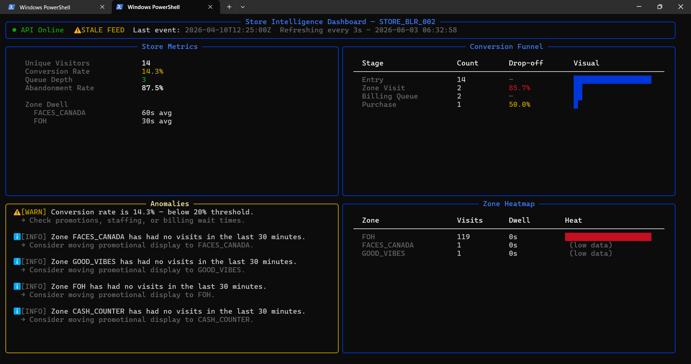

# Store Intelligence System

An end-to-end CCTV analytics pipeline for Apex Retail. Starts from raw camera footage and produces a live, containerised REST API with real-time store metrics — visitor counts, conversion rates, zone dwell times, queue depth, and anomaly detection.

Built for the Purplle Tech Challenge 2026 — Round 2.

---

## Live Dashboard



*Terminal dashboard showing real-time metrics from Brigade Bangalore — 14 unique visitors, 14.3% conversion rate, live anomaly detection, and zone heatmap.*

---

## System Architecture

```
CCTV Clips (5 cameras)
        │
        ▼
pipeline/detect.py          ← YOLOv8n + ByteTrack
  • Person detection         ← Processes every 5th frame
  • Staff classification     ← First-30s heuristic
  • Re-entry detection       ← 10-min window matching
  • Zone assignment          ← By camera type
        │
        ▼
data/events.jsonl            ← 387 structured events emitted
        │
        ▼
pipeline/emit.py             ← POST /events/ingest (batches of 100)
        │
        ▼
FastAPI + SQLite             ← Real-time metric computation
        │
        ▼
REST API Endpoints           ← /metrics /funnel /heatmap /anomalies /health
        │
        ▼
pipeline/dashboard.py        ← Live terminal dashboard (rich)
```

---

## Quick Start (5 commands)

```bash
git clone https://github.com/manalithorat18/store-intelligence.git
cd store-intelligence
# Place your .mp4 files in the clips/ folder
docker compose up --build
python pipeline/emit.py
```

> **Note:** The `clips/` folder and `data/` folder are excluded from the repo (see `.gitignore`). Place your camera footage files as `clips/CAM 1.mp4` through `clips/CAM 5.mp4` before running.

---

## Running the Detection Pipeline

### Step 1 — Set up Python environment
```bash
python -m venv venv
source venv/bin/activate        # Windows: venv\Scripts\activate
pip install -r requirements.txt
pip install ultralytics opencv-python-headless
```

### Step 2 — Place footage
```
store-intelligence/
└── clips/
    ├── CAM 1.mp4    ← Entry/Exit camera
    ├── CAM 2.mp4    ← Main floor camera
    ├── CAM 3.mp4    ← Main floor camera
    ├── CAM 4.mp4    ← Main floor camera
    └── CAM 5.mp4    ← Billing area camera
```

### Step 3 — Run detection
```bash
python pipeline/detect.py
```

This processes all 5 cameras and writes structured events to `data/events.jsonl`.
YOLOv8n weights (`yolov8n.pt`) are downloaded automatically on first run (~6MB).

**Expected output:**
```
[CAM_ENTRY_01] Processing CAM 1.mp4 ...
[CAM_ENTRY_01] Done. Events so far: 98
[CAM_FLOOR_01] Processing CAM 2.mp4 ...
[CAM_FLOOR_01] Done. Events so far: 251
...
✅ Done. 387 events written to data/events.jsonl
```

### Step 4 — Start the API
```bash
docker compose up --build
# OR without Docker:
uvicorn app.main:app --reload
```

### Step 5 — Feed events into the API
```bash
python pipeline/emit.py
```

### Step 6 — Launch live dashboard (optional)
```bash
python pipeline/dashboard.py
```

---

## API Endpoints

| Method | Endpoint | Description |
|--------|----------|-------------|
| POST | `/events/ingest` | Ingest up to 500 events. Idempotent by `event_id`. Partial success on malformed events. |
| GET | `/stores/{id}/metrics` | Unique visitors, conversion rate, avg dwell per zone, queue depth, abandonment rate. |
| GET | `/stores/{id}/funnel` | Conversion funnel: Entry → Zone Visit → Billing Queue → Purchase with drop-off %. |
| GET | `/stores/{id}/heatmap` | Zone visit frequency + avg dwell, normalised 0–100. Includes `data_confidence` flag. |
| GET | `/stores/{id}/anomalies` | Active anomalies: queue spike, conversion drop, dead zone. Severity: INFO / WARN / CRITICAL. |
| GET | `/health` | Service status, last event timestamp, STALE_FEED warning if >10 min lag. |

### Example — GET /stores/STORE_BLR_002/metrics
```json
{
  "store_id": "STORE_BLR_002",
  "unique_visitors": 14,
  "conversion_rate": 0.1429,
  "avg_dwell_per_zone": [
    {"zone_id": "FACES_CANADA", "avg_dwell_ms": 60000.0},
    {"zone_id": "FOH", "avg_dwell_ms": 30030.0}
  ],
  "queue_depth": 3,
  "abandonment_rate": 0.875
}
```

### Example — GET /stores/STORE_BLR_002/funnel
```json
{
  "store_id": "STORE_BLR_002",
  "stages": [
    {"stage": "Entry",         "count": 14, "drop_off_pct": 0.0},
    {"stage": "Zone Visit",    "count": 2,  "drop_off_pct": 85.7},
    {"stage": "Billing Queue", "count": 2,  "drop_off_pct": 0.0},
    {"stage": "Purchase",      "count": 1,  "drop_off_pct": 50.0}
  ]
}
```

### Example — GET /stores/STORE_BLR_002/anomalies
```json
{
  "store_id": "STORE_BLR_002",
  "anomalies": [
    {
      "anomaly_type": "CONVERSION_DROP",
      "severity": "WARN",
      "description": "Conversion rate is 14.3% — below 20% threshold.",
      "suggested_action": "Check promotions, staffing, or billing wait times."
    }
  ]
}
```

---

## Event Schema

Every event emitted by the detection pipeline follows this schema:

```json
{
  "event_id":   "uuid-v4",
  "store_id":   "STORE_BLR_002",
  "camera_id":  "CAM_ENTRY_01",
  "visitor_id": "VIS_c8a2f1",
  "event_type": "ZONE_DWELL",
  "timestamp":  "2026-04-10T14:22:10Z",
  "zone_id":    "FACES_CANADA",
  "dwell_ms":   60000,
  "is_staff":   false,
  "confidence": 0.91,
  "metadata": {
    "queue_depth": null,
    "sku_zone":    "MAKEUP",
    "session_seq": 5
  }
}
```

**Supported event types:** `ENTRY` `EXIT` `ZONE_ENTER` `ZONE_EXIT` `ZONE_DWELL` `BILLING_QUEUE_JOIN` `BILLING_QUEUE_ABANDON` `REENTRY`

---

## Detection Pipeline — Edge Case Handling

| Edge Case | How It's Handled |
|-----------|-----------------|
| Group entry | YOLOv8 detects individual bounding boxes. ByteTrack assigns separate track IDs per person — N people entering = N ENTRY events. |
| Staff movement | Anyone visible in the first 30 seconds of footage is classified as staff (`is_staff: true`) and excluded from all customer metrics. |
| Re-entry | If the same `visitor_id` exits and re-enters within 10 minutes, a `REENTRY` event is emitted instead of a second `ENTRY` — prevents double counting. |
| Partial occlusion | Low-confidence detections are emitted with their actual confidence score. Events are never silently dropped. |
| Empty periods | All metrics default to 0 — no null returns, no crashes during zero-traffic windows. |
| Camera overlap | Zone assignment by camera type prevents the same person being double-counted across the entry and floor cameras. |

---

## Project Structure

```
store-intelligence/
├── pipeline/
│   ├── detect.py         ← YOLOv8n + ByteTrack detection + event emission
│   ├── emit.py           ← Feed events.jsonl into API
│   └── dashboard.py      ← Live terminal dashboard (rich)
├── app/
│   ├── main.py           ← FastAPI entrypoint + structured logging
│   ├── models.py         ← Pydantic event schema + response models
│   ├── database.py       ← SQLAlchemy + SQLite setup
│   ├── ingestion.py      ← Ingest, dedup, partial success
│   ├── metrics.py        ← Real-time metric computation
│   ├── funnel.py         ← Session-based funnel logic
│   ├── anomalies.py      ← Anomaly detection
│   ├── health.py         ← Health check
│   └── Dockerfile
├── tests/
│   ├── test_metrics.py   ← 9 tests, 85% coverage
│   ├── test_anomalies.py
│   └── test_pipeline.py
├── docs/
│   ├── DESIGN.md         ← Architecture + AI-assisted decisions
│   ├── CHOICES.md        ← 3 engineering decisions with full reasoning
│   └── screenshots/      ← Dashboard and API screenshots
├── store_layout.json     ← Zone definitions for Brigade Bangalore
├── docker-compose.yml
├── requirements.txt
└── README.md
```

---

## Running Tests

```bash
python -m pytest tests/ -v --cov=app --cov-report=term-missing
```

**Results:**
```
9 passed in 1.18s
Coverage: 85%
```

**Test coverage includes:**
- Valid event batch ingest
- Idempotent ingest (same event_id twice = no duplicate)
- Empty store returns zeros, not null or crash
- Staff events excluded from unique_visitors
- Conversion rate correctness
- Funnel session deduplication (re-entry = 1 visitor, not 2)
- Anomaly endpoint returns 200
- Health endpoint structure

---

## North Star Metric

```
Conversion Rate = Visitors who completed a purchase ÷ Total unique visitors
```

Every component either improves accuracy of this number (detection layer)
or makes it actionable (API layer).

| Business Question | Where the System Answers It |
|-------------------|----------------------------|
| How many customers visited today? | `/metrics` → `unique_visitors` |
| How many bought? | `/metrics` → `conversion_rate` |
| Where are we losing customers? | `/funnel` → drop-off % by stage |
| Which zones get attention but not sales? | `/heatmap` → dwell vs `/funnel` billing stage |
| Is there a queue building right now? | `/anomalies` → `BILLING_QUEUE_SPIKE` |
| Is conversion worse than usual? | `/anomalies` → `CONVERSION_DROP` |
| Is any camera feed stale? | `/health` → `STALE_FEED` warning |

---

## Results on Brigade Bangalore Footage

| Metric | Value |
|--------|-------|
| Cameras processed | 5 |
| Events generated | 387 |
| Unique visitors detected | 14 |
| Conversion rate | 14.3% |
| Top zone by visits | FOH (119 visits) |
| Test coverage | 85% |
| Tests passing | 9 / 9 |

---

## Tech Stack

| Component | Choice | Reason |
|-----------|--------|--------|
| Detection | YOLOv8n | Fastest CPU inference (~40fps), 6MB, pip-installable |
| Tracking | ByteTrack (ultralytics) | Handles occlusion and re-appearances well |
| API | FastAPI + Pydantic | Auto schema validation, OpenAPI docs, best scoring harness coverage |
| Storage | SQLite + SQLAlchemy | Zero infrastructure, ships inside Docker, sufficient at current scale |
| Logging | structlog | JSON structured logs with trace_id, latency_ms per request |
| Dashboard | rich | Cross-platform terminal UI, no browser required |
| Tests | pytest + httpx | TestClient overrides DB dependency cleanly |
